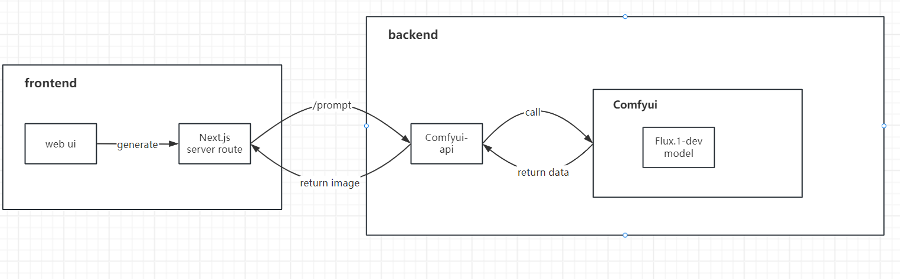

# FluxEz -基于comfyui和Next.js的Flux AI图像生成平台
基于Next.js和comfyui的Flux AI图像生成网站，后端图像生成采用[ComfyUI API](https://github.com/SaladTechnologies/comfyui-api) 驱动。

## ✨ 核心特色
⚡ 10秒生成 - 4090显卡加速

🎨 Flux.1-dev模型 - 卓越画质表现

🛠️ 高度可定制 - 支持多参数调节

🆓 完全免费 - 无限制无隐藏收费

🔌 开箱即用 - 无需登录配置

## 🚀 快速开始
[访问在线演示站](https://flux.comnergy.com/zh)

## 项目架构图


## 🖼️ 图像生成效果展示


## 🛠️ 开发指南

### 本地部署
```bash
git clone https://github.com/your-repo/fluxez.git
cd fluxez
npm install
npm run dev
# 启动后访问 http://localhost:3000
```
后端配置
ComfyUI API端点配置在.env文件中,本地测试可直接使用该文件，部署时需要重新指定。
```
COMFYUI_API_URL = "https://your-comfyui-api-url"
```
## 🐋 comfyui-api的Docker镜像构建（包含Flux模型的ComfyUI-api）
将Flux模型打包为ComfyUI的Docker镜像，并使用[ComfyUI API](https://github.com/SaladTechnologies/comfyui-api)进行封装。

### 先决条件
已安装Docker或docker desktop（windows）

### 构建流程
准备目录结构：
```
comfyUI/
└── Dockerfile
├── diffusion_models/
│   └── flux1-schnell.safetensors
├── text_encoders/
│   ├── clip_l.safetensors
│   └── t5xxl_fp8_e4m3fn.safetensors
├── vae/
│   └── ae.safetensors
```
使用Dockerfile：

```dockerfile
FROM ghcr.io/saladtechnologies/comfyui-api:comfy0.3.29-api1.8.3-torch2.6.0-cuda12.4-runtime

# 设置环境变量
ENV COMFYUI_PORT=8188 \
    MODEL_DIR=/opt/ComfyUI/models \
    BASE=""

# 4. 预创建模型目录结构
RUN mkdir -p ${MODEL_DIR}/{loras,vaes,text_encoders,diffusion_models}

# 5. 复制模型文件（
COPY diffusion_models/*.safetensors ${MODEL_DIR}/diffusion_models/
COPY vae/*.safetensors ${MODEL_DIR}/vae/
COPY text_encoders/*.safetensors ${MODEL_DIR}/text_encoders/

# 6. 暴露端口
EXPOSE ${COMFYUI_PORT}
```

接下来可自行构建镜像。
## 🤝 参与贡献
欢迎：

- 通过Issues提交功能建议

- 通过PR提交代码改进

## 📜 许可协议
MIT许可证 | © 2023 FluxEz项目

## 立即体验 
➡️ [FluxEz官网](https://flux.comnergy.com/zh)